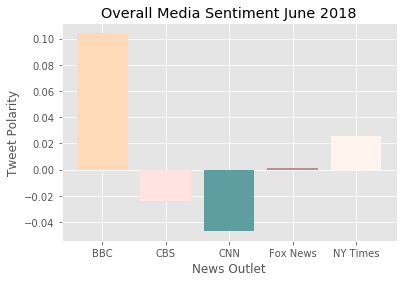
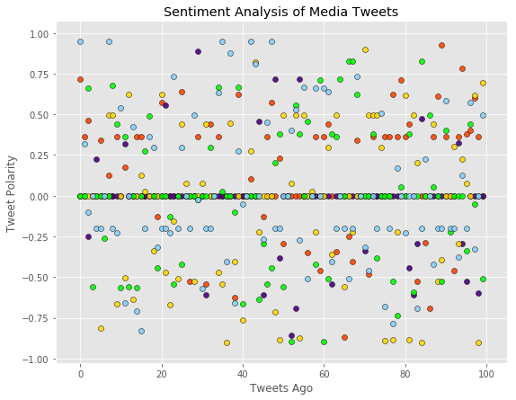

### Unit 7 | Assignment - Distinguishing Sentiments
#1. The overall sentiment of the BBC is more positive than the other media outlets evaluated.
#2.CNN's compound score is significantly more negative than the other media
#3.CNN's tweets that are extremely negative (-0.75 -1.0) whereas the other media tweets are moderately negative.


```python
import tweepy
import numpy as np
import pandas as pd
from datetime import datetime
import matplotlib.pyplot as plt
from matplotlib import style
style.use('ggplot')

from vaderSentiment.vaderSentiment import SentimentIntensityAnalyzer
analyzer = SentimentIntensityAnalyzer()

from config import (consumer_key, 
                    consumer_secret, 
                    access_token, 
                    access_token_secret)

auth = tweepy.OAuthHandler(consumer_key, consumer_secret)
auth.set_access_token(access_token, access_token_secret)
api = tweepy.API(auth)
```


```python
# Target Search Term
news = ("@CNN", "@BBC", "@NYtimes",
                "@CBS", "@Foxnews")

def get_news_df(news_name):
    tweets  = []
    for status in tweepy.Cursor(api.search, q=news_name).items(100):
        tweets.append(status)
    df = pd.DataFrame([x._json for x in tweets])[['text', 'created_at']]
    df['brand'] = news_name
    return df

dfs = [get_news_df(x) for x in news]
df_concat = pd.concat(dfs, axis=0)
```


```python
analyzer = SentimentIntensityAnalyzer() 

def get_sentiment(some_text):
    return analyzer.polarity_scores(some_text)
    

df_concat['sent'] = df_concat.text.map(get_sentiment)
df_concat['pos'] = df_concat.sent.map(lambda x: x.get('pos'))
df_concat['neg'] = df_concat.sent.map(lambda x: x.get('neg'))
df_concat['neu'] = df_concat.sent.map(lambda x: x.get('neu'))
df_concat['compound'] = df_concat.sent.map(lambda x: x.get('compound'))
```


```python
df_concat.head()
```


<div>
<style scoped>
    .dataframe tbody tr th:only-of-type {
        vertical-align: middle;
    }

    .dataframe tbody tr th {
        vertical-align: top;
    }

    .dataframe thead th {
        text-align: right;
    }
</style>
<table border="1" class="dataframe">
  <thead>
    <tr style="text-align: right;">
      <th></th>
      <th>text</th>
      <th>created_at</th>
      <th>brand</th>
      <th>sent</th>
      <th>pos</th>
      <th>neg</th>
      <th>neu</th>
      <th>compound</th>
    </tr>
  </thead>
  <tbody>
    <tr>
      <th>0</th>
      <td>@MariaTCardona  @TheRickWilson  @kathygriffin ...</td>
      <td>Sun Jul 01 22:03:41 +0000 2018</td>
      <td>@CNN</td>
      <td>{'neg': 0.0, 'neu': 1.0, 'pos': 0.0, 'compound...</td>
      <td>0.0</td>
      <td>0.0</td>
      <td>1.0</td>
      <td>0.0</td>
    </tr>
    <tr>
      <th>1</th>
      <td>RT @CNN: "How dare you. How dare you take the ...</td>
      <td>Sun Jul 01 22:03:41 +0000 2018</td>
      <td>@CNN</td>
      <td>{'neg': 0.0, 'neu': 1.0, 'pos': 0.0, 'compound...</td>
      <td>0.0</td>
      <td>0.0</td>
      <td>1.0</td>
      <td>0.0</td>
    </tr>
    <tr>
      <th>2</th>
      <td>RT @CNN: "How dare you. How dare you take the ...</td>
      <td>Sun Jul 01 22:03:41 +0000 2018</td>
      <td>@CNN</td>
      <td>{'neg': 0.0, 'neu': 1.0, 'pos': 0.0, 'compound...</td>
      <td>0.0</td>
      <td>0.0</td>
      <td>1.0</td>
      <td>0.0</td>
    </tr>
    <tr>
      <th>3</th>
      <td>@CNN #FamiliesBelongTogetherMarch @Acosta @Rea...</td>
      <td>Sun Jul 01 22:03:40 +0000 2018</td>
      <td>@CNN</td>
      <td>{'neg': 0.0, 'neu': 1.0, 'pos': 0.0, 'compound...</td>
      <td>0.0</td>
      <td>0.0</td>
      <td>1.0</td>
      <td>0.0</td>
    </tr>
    <tr>
      <th>4</th>
      <td>@CNN BREAKING: CNN is pushing for the impeachm...</td>
      <td>Sun Jul 01 22:03:40 +0000 2018</td>
      <td>@CNN</td>
      <td>{'neg': 0.0, 'neu': 1.0, 'pos': 0.0, 'compound...</td>
      <td>0.0</td>
      <td>0.0</td>
      <td>1.0</td>
      <td>0.0</td>
    </tr>
  </tbody>
</table>
</div>


```python
df_concat.to_csv('newstweets.csv')
```


```python
grouped_media_comp=df_concat.groupby('brand').mean()
grouped_media_comp.drop(grouped_media_comp.columns[[0,1,2,]], axis=1, inplace=True)
```


```python
grouped_media_comp.head()
```


<div>
<style scoped>
    .dataframe tbody tr th:only-of-type {
        vertical-align: middle;
    }

    .dataframe tbody tr th {
        vertical-align: top;
    }

    .dataframe thead th {
        text-align: right;
    }
</style>
<table border="1" class="dataframe">
  <thead>
    <tr style="text-align: right;">
      <th></th>
      <th>compound</th>
    </tr>
    <tr>
      <th>brand</th>
      <th></th>
    </tr>
  </thead>
  <tbody>
    <tr>
      <th>@BBC</th>
      <td>0.104064</td>
    </tr>
    <tr>
      <th>@CBS</th>
      <td>-0.023743</td>
    </tr>
    <tr>
      <th>@CNN</th>
      <td>-0.046743</td>
    </tr>
    <tr>
      <th>@Foxnews</th>
      <td>0.001298</td>
    </tr>
    <tr>
      <th>@NYtimes</th>
      <td>0.025590</td>
    </tr>
  </tbody>
</table>
</div>


```python
height = grouped_media_comp["compound"]
bars = ('BBC', 'CBS', 'CNN', 'Fox News', 'NY Times')
y_pos = np.arange(len(bars))
plt.title("Overall Media Sentiment June 2018")
plt.ylabel('Tweet Polarity')
plt.xlabel('News Outlet')

plt.bar(y_pos, height, color=['peachpuff', 'mistyrose', 'cadetblue', 'rosybrown', 'seashell'])
plt.xticks(y_pos, bars)
plt.show()
```





```python
df_concat['tweetsago'] = df_concat.index
df_concat.head()
```


<div>
<style scoped>
    .dataframe tbody tr th:only-of-type {
        vertical-align: middle;
    }

    .dataframe tbody tr th {
        vertical-align: top;
    }

    .dataframe thead th {
        text-align: right;
    }
</style>
<table border="1" class="dataframe">
  <thead>
    <tr style="text-align: right;">
      <th></th>
      <th>text</th>
      <th>created_at</th>
      <th>brand</th>
      <th>sent</th>
      <th>pos</th>
      <th>neg</th>
      <th>neu</th>
      <th>compound</th>
      <th>tweetsago</th>
    </tr>
  </thead>
  <tbody>
    <tr>
      <th>0</th>
      <td>@MariaTCardona  @TheRickWilson  @kathygriffin ...</td>
      <td>Sun Jul 01 22:03:41 +0000 2018</td>
      <td>@CNN</td>
      <td>{'neg': 0.0, 'neu': 1.0, 'pos': 0.0, 'compound...</td>
      <td>0.0</td>
      <td>0.0</td>
      <td>1.0</td>
      <td>0.0</td>
      <td>0</td>
    </tr>
    <tr>
      <th>1</th>
      <td>RT @CNN: "How dare you. How dare you take the ...</td>
      <td>Sun Jul 01 22:03:41 +0000 2018</td>
      <td>@CNN</td>
      <td>{'neg': 0.0, 'neu': 1.0, 'pos': 0.0, 'compound...</td>
      <td>0.0</td>
      <td>0.0</td>
      <td>1.0</td>
      <td>0.0</td>
      <td>1</td>
    </tr>
    <tr>
      <th>2</th>
      <td>RT @CNN: "How dare you. How dare you take the ...</td>
      <td>Sun Jul 01 22:03:41 +0000 2018</td>
      <td>@CNN</td>
      <td>{'neg': 0.0, 'neu': 1.0, 'pos': 0.0, 'compound...</td>
      <td>0.0</td>
      <td>0.0</td>
      <td>1.0</td>
      <td>0.0</td>
      <td>2</td>
    </tr>
    <tr>
      <th>3</th>
      <td>@CNN #FamiliesBelongTogetherMarch @Acosta @Rea...</td>
      <td>Sun Jul 01 22:03:40 +0000 2018</td>
      <td>@CNN</td>
      <td>{'neg': 0.0, 'neu': 1.0, 'pos': 0.0, 'compound...</td>
      <td>0.0</td>
      <td>0.0</td>
      <td>1.0</td>
      <td>0.0</td>
      <td>3</td>
    </tr>
    <tr>
      <th>4</th>
      <td>@CNN BREAKING: CNN is pushing for the impeachm...</td>
      <td>Sun Jul 01 22:03:40 +0000 2018</td>
      <td>@CNN</td>
      <td>{'neg': 0.0, 'neu': 1.0, 'pos': 0.0, 'compound...</td>
      <td>0.0</td>
      <td>0.0</td>
      <td>1.0</td>
      <td>0.0</td>
      <td>4</td>
    </tr>
  </tbody>
</table>
</div>


```python
BBC = df_concat[df_concat['brand'] =='@BBC']
CBS = df_concat[df_concat['brand'] =='@CBS']
CNN = df_concat[df_concat['brand'] =='@CNN']
Fox = df_concat[df_concat['brand'] =='@Foxnews']
NYT = df_concat[df_concat['brand'] =='@NYtimes']
```


```python
fig = plt.figure()
ax = fig.add_subplot(111)

ax.scatter(x='tweetsago', y='compound', data=BBC, c='orangered', alpha = 0.9,edgecolors="black",)
ax.scatter(x='tweetsago', y='compound', data=CBS, c='indigo', alpha = 0.9,edgecolors="black",)
ax.scatter(x='tweetsago', y='compound', data=CNN, c='gold', alpha = 0.9,edgecolors="black",)
ax.scatter(x='tweetsago', y='compound', data=Fox, c='lime', alpha = 0.9,edgecolors="black",)
ax.scatter(x='tweetsago', y='compound', data=NYT, c='lightskyblue', alpha = 0.9,edgecolors="black",)


plt.xlabel("Tweets Ago")
plt.ylabel("Tweet Polarity")
plt.title("Sentiment Analysis of Media Tweets")


#ax.legend((title),loc='upper right', shadow=True)
plt.grid(True)

# resize the figure to match the aspect ratio of the Axes    
fig.set_size_inches(9, 7, forward=True)


plt.show()
```




